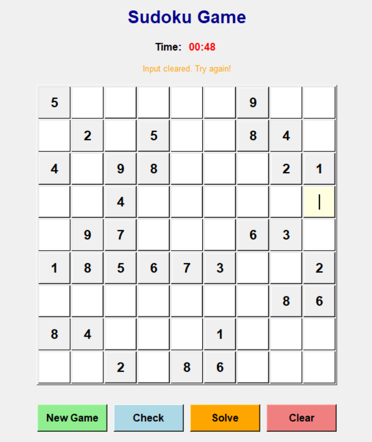
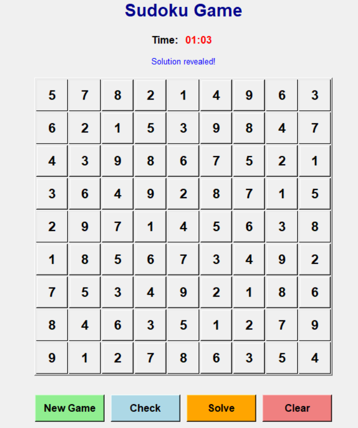

# SUDOKU-PY

> Interactive Python Sudoku game with GUI - Generate, play, and solve Sudoku puzzles!


## What is this?

SUDOKU-PY is a Python-based Sudoku game that includes:
- **Interactive GUI** - Full-featured graphical interface for playing Sudoku
- **Puzzle Generator** - Creates valid Sudoku puzzles with varying difficulty
- **Terminal versions** - Command-line puzzle generation for quick testing


## ✨ Features

### GUI Version (`gui.py`)
- **Interactive Game Interface** - Beautiful tkinter-based GUI with 9x9 grid
- **Real-time Timer** - Track your solving time
- **Smart Input Validation** - Only allows valid numbers (1-9) and prevents conflicts
- **Game Controls**:
  - **New Game** - Generate a fresh puzzle
  - **Check** - Validate your current solution
  - **Solve** - Reveal the complete solution
  - **Clear** - Reset user input while keeping the original puzzle
- **Visual Feedback** - Different colors for original clues, user input, and solution
- **Keyboard Navigation** - Arrow keys for easy cell navigation
- **Auto-completion Detection** - Automatically detects when puzzle is solved

### Terminal Versions
- `sudoku.py` - Generates completed Sudoku grids (tabulate format)
- `board.py` - Alternative generator with fancy grid display
- `generate-sudoku.py` - Basic ASCII grid generator

## 🚀 Quick Start

### Prerequisites
- Python 3.7 or higher
- `tkinter` (usually comes with Python)
- `tabulate` library (for terminal versions)

### Installation

1. Clone the repository:
```bash
git clone https://github.com/yourusername/py-sudoku.git
cd py-sudoku
```

2. Create a virtual environment (recommended):
```bash
python3 -m venv sudoku
source sudoku/bin/activate 
```

3. Install dependencies:
```bash
pip install -r requirements.txt
```

### Running the app

**GUI Version (Recommended):**
```bash
python gui.py           # Launch interactive GUI game
```

**Terminal Versions:**
```bash
python sudoku.py        # Pretty table format
python board.py         # Fancy grid format
python generate-sudoku.py  # ASCII grid format
```

## 📸 Screenshots

### GUI Interface

*Interactive Sudoku game with timer and control buttons*


*Game features including puzzle generation, validation, and solving*

## 🎮 How to Play (GUI)

1. **Launch the game**: Run `python gui.py`
2. **New puzzle**: Click "New Game" to generate a fresh puzzle
3. **Fill cells**: Click on empty cells and type numbers 1-9
4. **Navigation**: Use arrow keys to move between cells
5. **Check progress**: Click "Check" to validate your solution
6. **Get help**: Click "Solve" to see the complete solution
7. **Start over**: Click "Clear" to reset your input

### Game Features
- **Timer**: Tracks your solving time automatically
- **Visual cues**: 
  - Gray cells = Original puzzle clues (read-only)
  - Yellow cells = Your input (editable)
  - Blue cells = Solution revealed
- **Smart validation**: Only allows valid Sudoku numbers
- **Auto-completion**: Game detects when you've solved the puzzle

